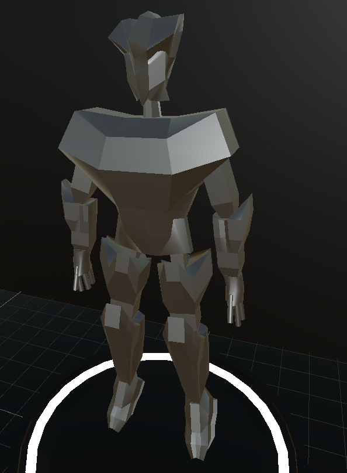
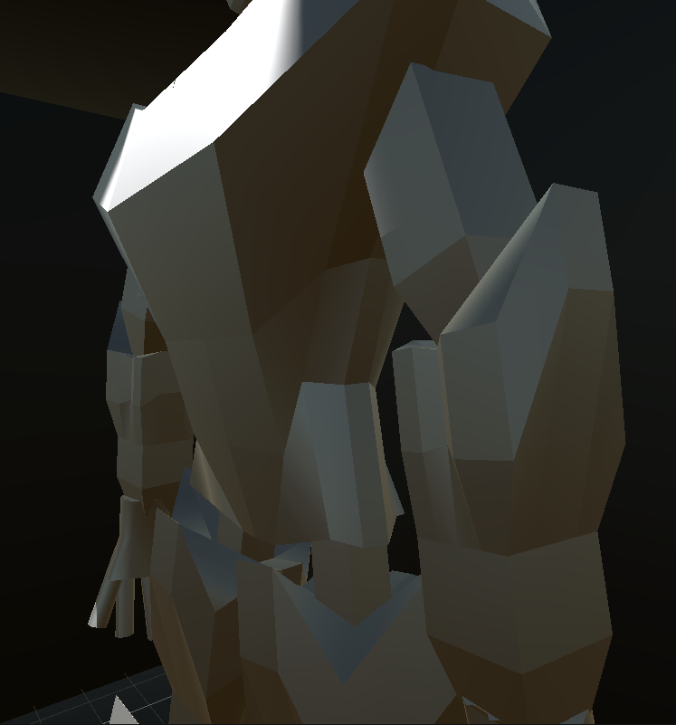
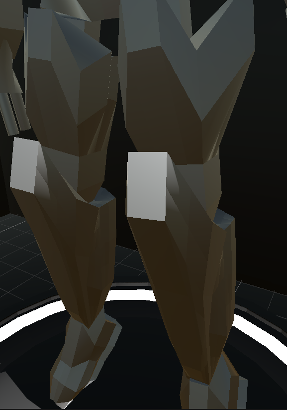

# Project Title

Name: Siu Dzoen Lee

Student Number: C19401596

Class Group: TU856

Video:

# Description of the project

This is project is to create an interactable robotic body floating on a display, the idea of a robot or mech rather is inspired by Gundam (in case you question if this is in spec with the assignment brief, Gundam came out in 1979).

The action performed in order to interact with this robot is through a set of buttons in front of this display. Once a button is pushed,
an interaction will be showcased like it changing its pose, rotating it or bopping it up and down, changing lighting effects etc.

## Proposal for project:

The initial proposal for this project is still similar however a few changes have been made. The intial plan was still to create an interactable robot but
instead I have it so that the robot is lying flat on its back and the interactions you have is by being able to pick apart the robot. Think of this like a
human anatomical body where you can pull apart its organs and inspect them.

With all this said, I have scaled down the project and decided to go with an alternative route as described in the description due to time contraints with FYP.

# Instructions on how to play

## Movement
To move around in the scene, use the following keyboard bindings:
* 'W' - Foward
* 'S' - Backward
* 'A' - Left
* 'D' - Right

## Interact
To interact with interactable objects like a button, use the following key binding:
* 'E' - Interact

## Camera
For looking around in the scene, simply move the mouse to rotate the camera

# How it works
When you enter the world scene, you will be inside a small room with three buttons on a panel connected to a cylindrical stand.
Each button will have it's own governing interaction. The first button will initially spawn in the robot and from there you can
keep on pressing the button to switch betweeen poses. The second button will change the spotlight shooting down on the robot to fade in and out.
Finally, the third button will change the light from a starting color of choice to another colour.

# List of classes/assets in the project

| Class/asset | Source |
|-----------|-----------|
| InputManager.cs | Self written |
| PlayerController.cs | Generated by Unity's Input Manager|
| PlayerManager.cs | Self written |
| PlayerMovement.cs | Self written |
| PlayerUI | Modifed From [reference](https://www.youtube.com/watch?v=gPPGnpV1Y1c&list=PL3hhqEqLiX1EUVpxCPaQlJzsvS7568mtS&index=8) |
| CameraManager.cs | Self Written |
| InteractionManager.cs | Modified From [reference](https://www.youtube.com/watch?v=gPPGnpV1Y1c&list=PL3hhqEqLiX1EUVpxCPaQlJzsvS7568mtS&index=8) |
| Interactable.cs | Modified From [reference 1](https://www.youtube.com/watch?v=gPPGnpV1Y1c&list=PL3hhqEqLiX1EUVpxCPaQlJzsvS7568mtS&index=8) & [reference 1](https://dotnettutorials.net/lesson/template-method-design-pattern/) |
| ButtonManager.cs | Modified From [reference 2](https://www.youtube.com/watch?v=gPPGnpV1Y1c&list=PL3hhqEqLiX1EUVpxCPaQlJzsvS7568mtS&index=8) & [reference 2](https://dotnettutorials.net/lesson/template-method-design-pattern/) |
| RobotSwitcher.cs | Self written |
| ChangeLight.cs | Self written |
| FadeLight.cs | Self written |
| All 3D Assets in Game Scene | Self Made |

# What I am most proud of in the assignment

What I'm most proud of is the time and effort it took to model the robot for this assignment.
I spent the better part of nearly an entire day trying to get it right and I am quite pleased
with the results.

# What I learned

What I learned and found really useful is the use of raycasts. Upon using them I learned that there is a lot of uses for it in terms game development.
Like checking the type of surface the player is walking on or what they are looking at. 

On top of this, I learnt that there is through the use of an abstract class
and applying the template method design pattern. This is very handy to use for implementing interactable objects in games.

Another thing I learned is how animations work in Unity, for the button interaction I decided not to go with simply having a static button that doesn't move but instead create animations for it instead. After much trial and error, I've finally completed a working button. 

However, the intial version of this button was kinda funky. I wanted the button, when pressed it will pop back up again, but instead the initial version only pops back up again if you press again of which isn't really nice to operate. The solution to this was something I've previously learned but kinda forgotten, of which is coroutines. By applying a coroutine, I had it so that there was delay after the press animation started and once the delay has ended, it then triggered the release animation.